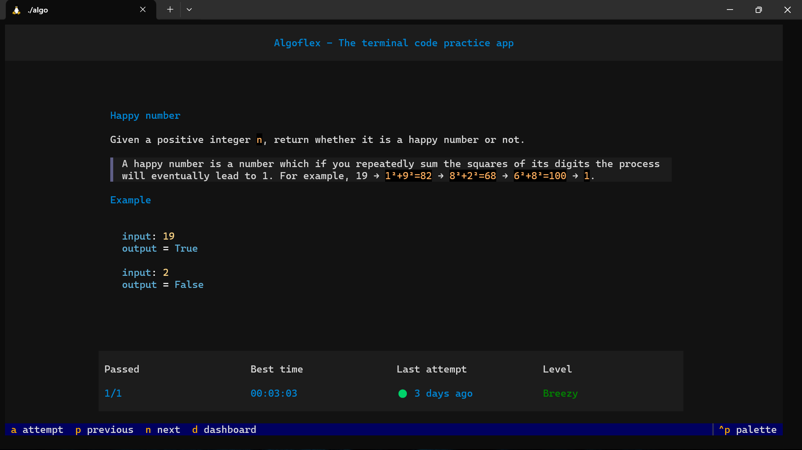
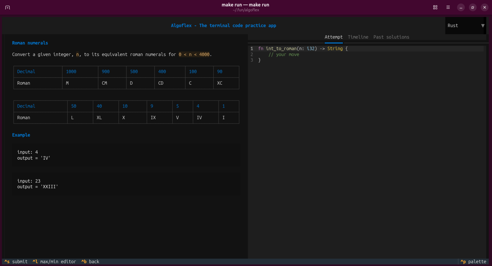
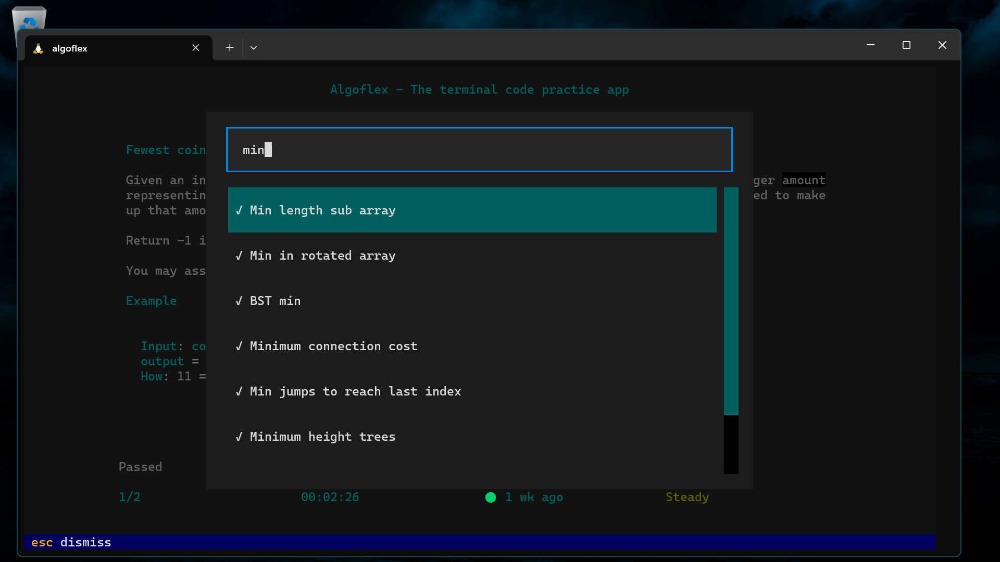
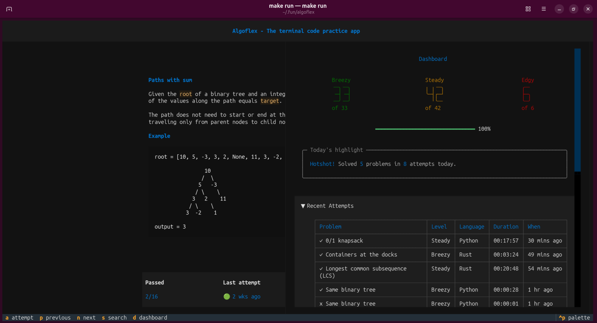

# Algoflex

**Sharpen your algorithm skills — right from the terminal.**

Algoflex is a lightweight, terminal-based platform for practicing algorithms and improving problem-solving skills. It provides a curated collection of coding problems, fast feedback, and progress tracking — all without leaving your command line.



## Features

* **Lightweight & offline-first** — Practice algorithms without relying on an internet connection.
* **Cross-platform** — Runs on Linux, macOS, and Windows.
* **Curated problem set** — A focused collection of algorithm and data structure problems designed to strengthen fundamental problem-solving skills.
* **Keyboard-driven interface** — Navigate quickly and efficiently without a mouse. Mouse input is supported as well.
* **Progress tracking** — Track your performance, compare solve times, and identify areas for improvement.
* **Multiple languages** — Solve problems using Python or Rust.

## Algorithm & Data Structures

Algoflex's curated problem set covers a range of fundamental algorithms and data structures, including:

* Arrays & Strings
* Linked Lists
* Stacks & Queues
* Hashing
* Trees & Binary Search Trees
* Heaps & Priority Queues
* Graphs
* Searching & Sorting
* Greedy Algorithms
* Dynamic Programming
* Backtracking
* Recursion
* Intervals
* Bit Manipulation

The problem set is designed to reinforce core concepts, develop problem-solving patterns, and provide progressively challenging practice.

## Installation

Algoflex requires **Python 3.12 or later** and runs on **Linux, macOS, and Windows**.

To solve problems in **Rust**, you must also have **Rust 1.97 or later** installed on your system. See the official [Rust installation guide](https://www.rust-lang.org/tools/install) for instructions.

### Using `uv`

Install Algoflex as a standalone tool with [Astral's `uv`](https://docs.astral.sh/uv/):

```bash
uv tool install algoflex
```

### Using `pip`

Alternatively, install Algoflex with `pip`:

```bash
pip install algoflex
```

## Getting Started

Once installed, launch Algoflex from your terminal:

```bash
algoflex
```

Choose a problem, write your solution, run the tests, and review your results.

## Supported Languages

Algoflex currently supports:

* **Python 3.12+**
* **Rust 1.97+**

## Screenshots

### Attempt Screen



### Search



### Dashboard



## Development

Algoflex uses uv for project management. Make sure you have installed uv. 

To set up Algoflex for local development, clone the repo, install dependencies and set up git pre commit hooks using:

```bash
git clone https://github.com/ndero/algoflex.git
cd algoflex
make setup
```

Run the test suite with:

```bash
make test
```

Build and run algoflex locally with:

```bash
make run
```

## License

Algoflex is licensed under the **MIT License**.

See the `LICENSE` file for the full license text.
