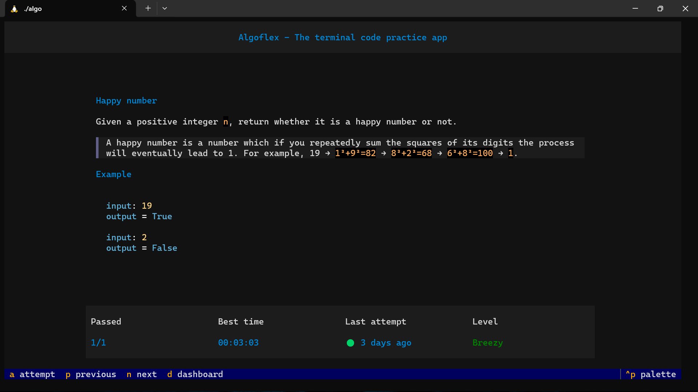
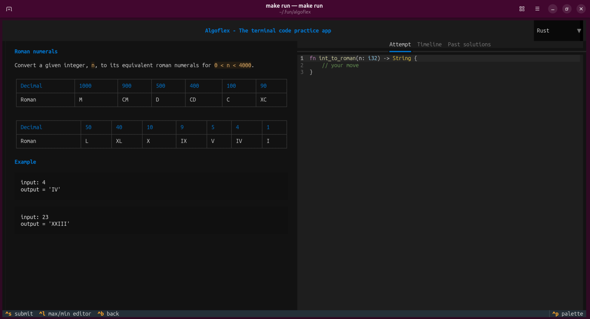
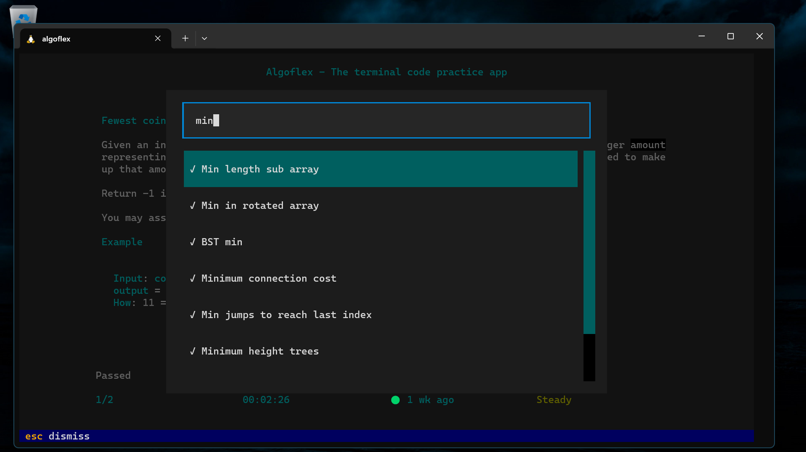
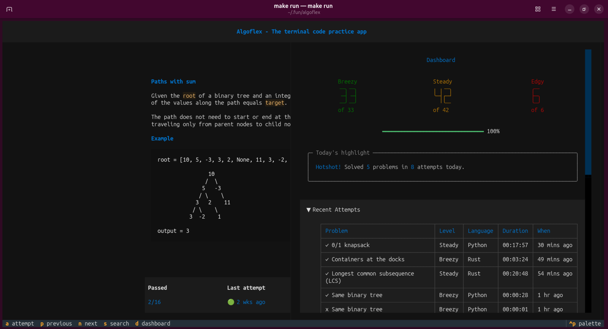

# Algoflex

**Sharpen your algorithm skills — right from the terminal.**

Algoflex is a lightweight, offline-first terminal application for practicing algorithms and data structures. It provides a curated collection of coding problems, fast local feedback, and persistent progress tracking — without requiring an account, server, or browser.



## Why Algoflex?

Algoflex is designed around a simple idea: algorithm practice should be fast, focused, and available anywhere a terminal is available.

It combines a keyboard-driven TUI with local problem data, automated code execution, test feedback, and performance tracking. Everything runs locally, making it suitable for practicing without an internet connection.

## Features

* **Offline-first** — Practice without relying on an internet connection or remote services.
* **Cross-platform** — Runs on Linux, macOS, and Windows.
* **Keyboard-driven TUI** — Navigate and solve problems efficiently from the terminal. Mouse input is also supported.
* **Curated problem set** — A focused collection of algorithm and data-structure problems designed to strengthen fundamental problem-solving skills.
* **Multiple languages** — Solve problems using Python or Rust.
* **Automated testing** — Run problem-specific tests against your solution and receive immediate feedback.
* **Progress tracking** — Track solve times, recent activity, historical attempts, and areas for improvement.
* **Local persistence** — Problem attempts, drafts, language preferences, and performance data are stored locally.

## How It Works

At a high level, Algoflex consists of a terminal user interface, a local persistence layer, and a code execution system.

```text
                   ┌──────────────────────┐
                   │    Textual TUI       │
                   │ Problems / Search /  │
                   │ Attempts / Dashboard │
                   └──────────┬───────────┘
                              │
             ┌────────────────┼────────────────┐
             │                                 │
             ▼                                 ▼
    ┌─────────────────┐              ┌─────────────────┐
    │ SQLite Storage  │              │ Code Execution  │
    │                 │              │                 │
    │ Attempts        │              │ Python          │
    │ Drafts          │              │ Rust            │
    │ Languages       │              │ Tests / Output  │
    │ Performance     │              │ Timeouts        │
    └─────────────────┘              └─────────────────┘
```

Solutions are executed locally as subprocesses. Python and Rust have language-specific source and test handling, including Rust compilation, output streaming, compile-error handling, and configurable execution timeouts.

## Algorithms & Data Structures

The curated problem set covers fundamental algorithms and data structures, including:

* Arrays & Strings
* Linked Lists
* Stacks & Queues
* Hashing
* Trees & Binary Search Trees
* Heaps & Priority Queues
* Graphs
* Searching & Sorting
* Greedy Algorithms
* Dynamic Programming
* Backtracking
* Recursion
* Intervals
* Bit Manipulation

Problems are curated to reinforce core concepts and develop reusable problem-solving patterns across increasing levels of difficulty. Their order is randomized on each startup, encouraging independent problem-solving.

## Installation

Algoflex requires **Python 3.12 or later** and runs on **Linux, macOS, and Windows**.

Rust solutions additionally require **Rust 1.97 or later**.

### Using `uv`

Install Algoflex as a standalone tool with [uv](https://docs.astral.sh/uv/):

```bash
uv tool install algoflex
```

### Using `pip`

Alternatively:

```bash
pip install algoflex
```

## Getting Started

Launch Algoflex from your terminal:

```bash
algoflex
```

Choose a problem, write your solution, run the tests, and review your results.

## Supported Languages

* **Python 3.12+**
* **Rust 1.97+**

## Screenshots

### Attempt



### Search



### Dashboard



## Development

Algoflex uses `uv` for project and dependency management, with pytest for testing, Ruff for linting and formatting, pre-commit hooks for local checks, and GitHub Actions for continuous integration, build validation, and tagged releases.

Clone the repository:

```bash
git clone https://github.com/ndero/algoflex.git
cd algoflex
```

Set up the development environment and install Git hooks:

```bash
make setup
```

Run the test suite:

```bash
make test
```

Run linting:

```bash
make lint
```

Check formatting:

```bash
make format-check
```

Build the package:

```bash
make build
```

Build and run the local application:

```bash
make run
```

Run the full project checks:

```bash
make check
```

## License

Algoflex is licensed under the **MIT License**.

See the [`LICENSE`](LICENSE) file for the full license text.
